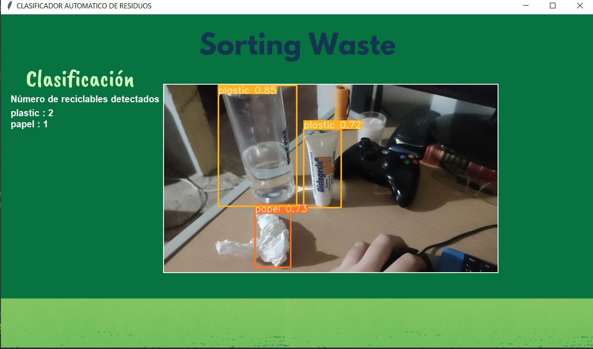
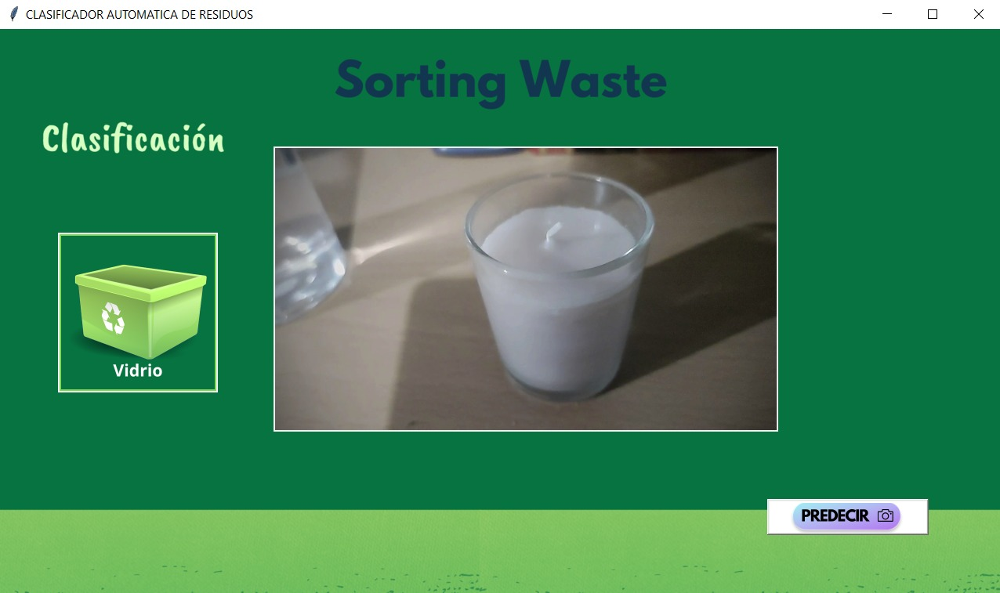

# Sorting Waste 

Proyecto de clasificación de reciclables a traves IA y machine learning
# 🗑️ Sorting Waste

> Sistema inteligente de clasificación de residuos mediante IA y Machine Learning

## 📋 Descripción

**Sorting Waste** es un proyecto que implementa un sistema de clasificación automática de residuos reciclables utilizando **Transfer Learning** con MobileNetV2 y **detección de objetos** con YOLOv26. El sistema puede identificar y clasificar residuos en tiempo real a través de la cámara.

### 🎯 Características Principales

- **Clasificación de imágenes**: Modelo entrenado con Transfer Learning 
- **Detección de objetos**: Implementación con YOLOv26 para localización en tiempo real (No se incluye modelo por seguridad) 
- **Procesamiento en vivo**: Análisis de video en tiempo real desde cámara
- **Múltiples categorías**: Clasificación en vidrio, metal, papel y plástico
- **Modelos entrenables**: Scripts para entrenar tus propios modelos

---

## 🚀 Inicio Rápido

### Requisitos Previos

- Python 3.8+
- pip
- Git
- Cámara web (para ejecución en tiempo real)
- [Visual C++ Redistributable](https://learn.microsoft.com/en-us/cpp/windows/latest-supported-vc-redist?view=msvc-170) (Windows)

## Capturas

